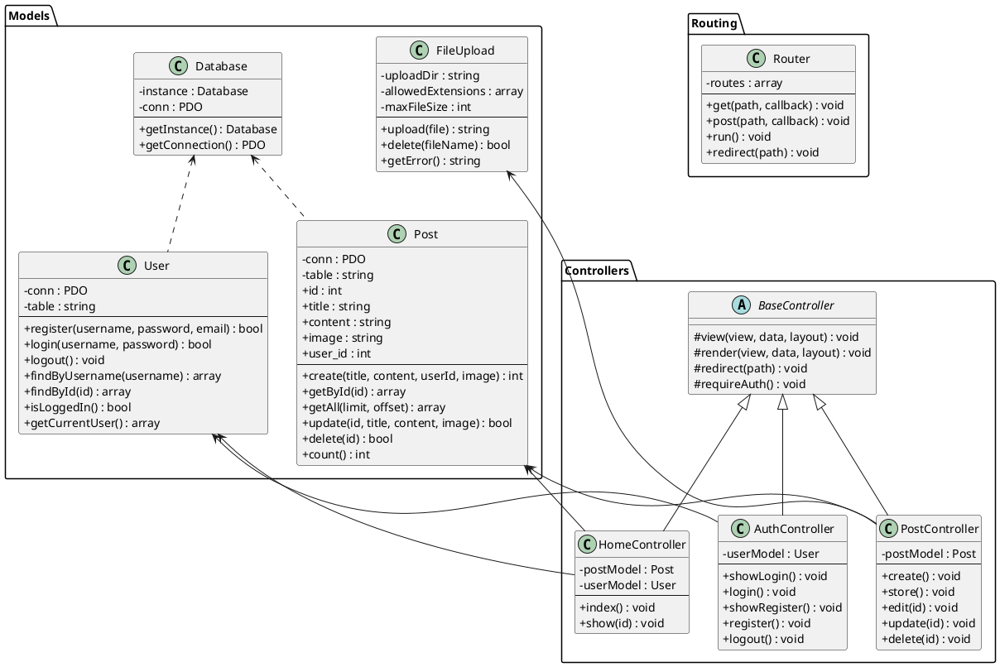
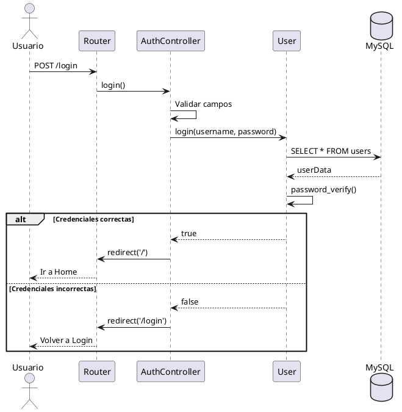
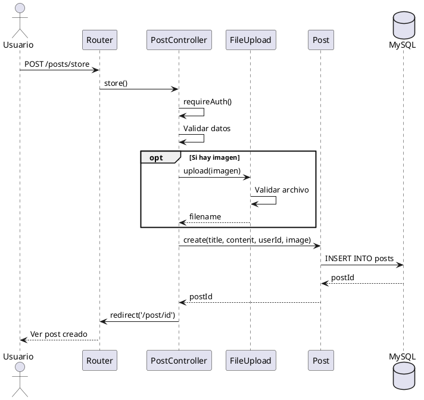
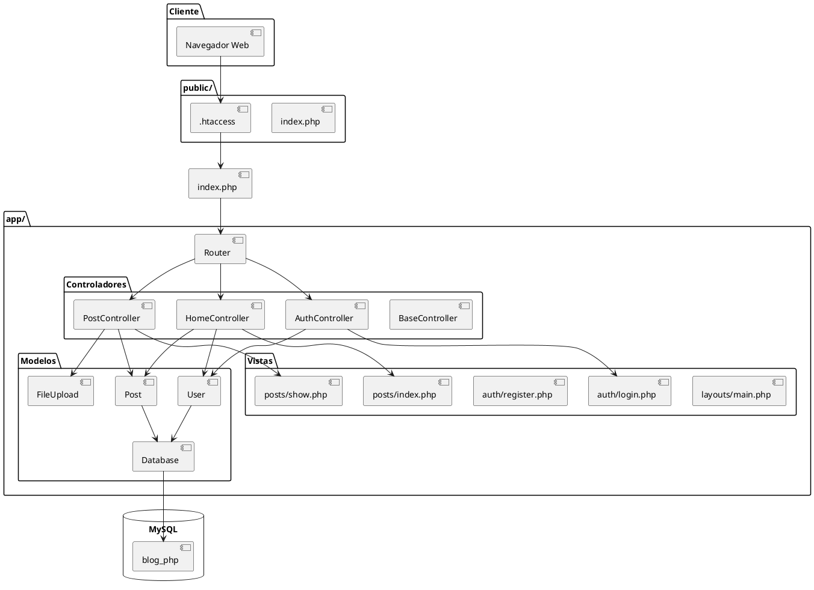
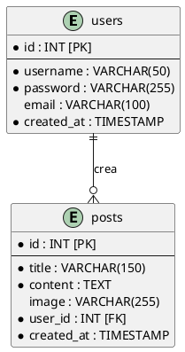
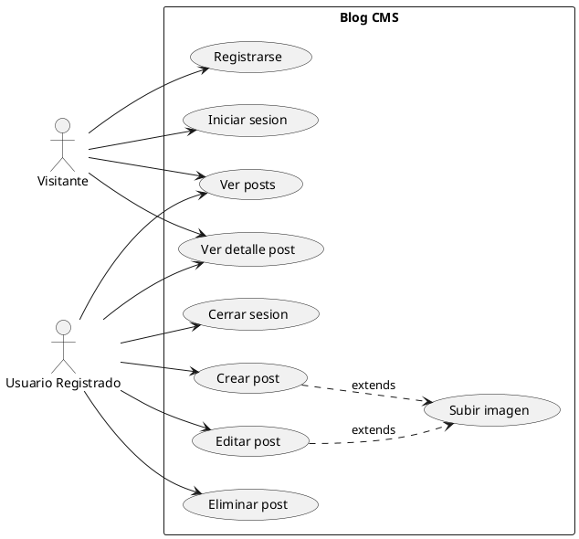

# 📊 Diagramas UML - Blog CMS

> 💡 **Para visualizar**: Copia el código en [www.plantuml.com/plantuml](https://www.plantuml.com/plantuml/uml/)

---

## 1. 📦 Diagrama de Clases

---

## 2. 🔄 Diagrama de Secuencia - Login

---

## 3. 🔄 Diagrama de Secuencia - Crear Post

---

## 4. 🏗️ Diagrama de Componentes - Arquitectura MVC

---

## 5. 🗃️ Diagrama Entidad-Relación

---

## 6. 📋 Diagrama de Casos de Uso

---

## 🔧 Cómo Visualizar

1. Ve a **[plantuml.com/plantuml](https://www.plantuml.com/plantuml/uml/)**
2. Copia el código entre `@startuml` y `@enduml`
3. Se genera la imagen automáticamente
4. Puedes descargarla como PNG o SVG

---

## 📝 Resumen

| Diagrama | Qué muestra |
|----------|-------------|
| **Clases** | Estructura de las clases PHP |
| **Secuencia Login** | Proceso de autenticación |
| **Secuencia Crear Post** | Proceso de crear publicación |
| **Componentes** | Arquitectura MVC del proyecto |
| **Entidad-Relación** | Tablas de la base de datos |
| **Casos de Uso** | Funcionalidades por usuario |

---

*Blog CMS - Diciembre 2025*
